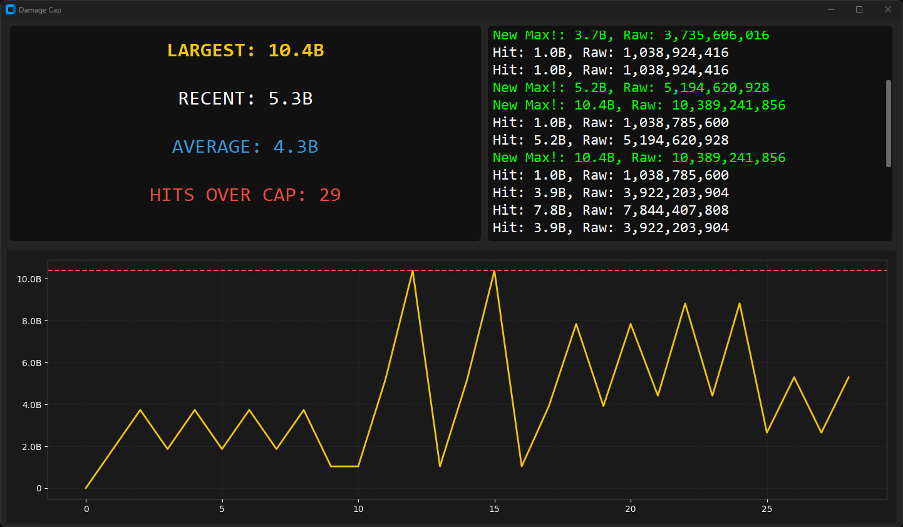

# Warframe Damage Cap Tracker

Have you ever wanted to see just how much damage you were really doing in Warframe when you see the silly negative numbers? Have no fear! 
This passion project is a dashboard put together to monitor real-time damage hits exceeding the 32-bit integer cap.
Open to suggestions should they come, otherwise I hope you enjoy. 

## Features
- **Live Stats:** See your largest hit, recent hit, and average damage.
- **Dynamic Graph:** Watch your damage trend in real-time.
- **History Log:** A scrolling list of hits with human-readable scales (Billion, Trillion, etc.) calling out when you hit a new best.

## How to Use
1. Download the `Dashboard.exe` from the **Releases** section or build from source.
2. Launch Warframe.
3. Run the tracker. It will automatically find your `EE.log` and start listening.

## Build Requirements
If running from source, you will need:
- Python 3.10+
- Run `pip install -r requirements.txt`

- Run the main file

