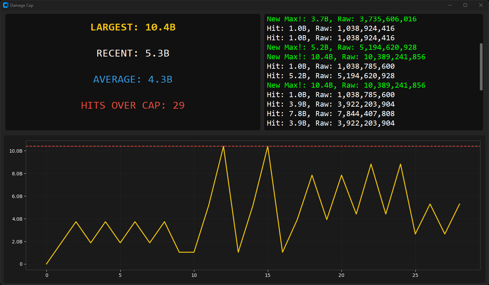

# Warframe Damage Cap Tracker 2.0

A **Warframe damage tracker** and **damage cap monitor** for Windows that watches `EE.log` in real time, detects hits above the cap, and displays a clean live dashboard with stats, history, and a trend graph.

If you have ever searched for a **Warframe log analyzer**, **EE.log damage tracker**, **cap breach tracker**, or a **live Warframe damage dashboard**, this app is built for that exact use case.

## What’s New in 2.0

- Redesigned into a compact **dark grey/black UI** with subtle red accents
- Cleaner, more readable stat cards
- Expanded stat labels for clarity
- Live log entries now use short timestamps like `2026-05-04 10:24`
- Highest Hit and Last Cap Breach now show the actual damage numbers
- Added session stats like hits per minute, session duration, mean damage, and standard deviation
- Improved save/restore behavior for session history
- Smarter layout with stats on the left and log + graph stacked on the right

## Features

- **Real-time Warframe log monitoring** — automatically finds and watches `EE.log`
- **Damage cap hit tracking** — captures hits above the cap as they happen
- **Live stats dashboard** — shows:
  - Highest Hit
  - Last Cap Breach
  - Mean Damage
  - Standard Deviation
  - Hits Per Minute
  - Session Duration
  - Top 3 Hits
  - Above Cap Hits
- **Scrollable event log** — compact entries with readable timestamps and damage values
- **Live trend graph** — visualizes recent hit history in real time
- **Automatic save and restore** — keeps your session data in `savelog.json`
- **Reset button** — clears the current session whenever you want a fresh run

## Screenshots



## How It Works

The tracker watches your Warframe log file and looks for damage lines above the cap. When a hit is detected, it:

- updates the latest stats
- appends the hit to the log view
- updates the trend chart
- saves session history for later restore

## Usage

1. Launch Warframe.
2. Start the tracker.
3. Leave it running while you play.
4. The app will automatically pick up hits from `EE.log`.

## Save File Location

Saved tracker state is stored at:

`%LOCALAPPDATA%\Warframe\savelog.json`

## Build Requirements

If you're building from source, install:

- Python 3.10+
- Dependencies from `requirements.txt`
- PyInstaller for packaging

```bash
pip install -r requirements.txt
pip install pyinstaller
```

## Build an EXE with the Icon

From the project folder, run:

```bash
pyinstaller --noconfirm --onefile --windowed --icon=warframe.ico --name="WF Damage Tracker" Dashboard.py
```

That will create a Windows executable in the `dist` folder.

## Run From Source

```bash
python Dashboard.py
```

## SEO / Search Keywords

Warframe damage tracker, Warframe damage cap tracker, Warframe log tracker, Warframe log analyzer, EE.log tracker, EE.log damage monitor, live Warframe damage dashboard, Warframe cap breach tracker, damage tracker for Warframe, Warframe stats dashboard, Windows desktop tracker

## Notes

- The UI is intentionally compact and modern to keep the stats easy to scan while playing.
- The log view uses short timestamp formatting for readability.
- Saved sessions are restored automatically on launch.
- The app is designed for Windows and expects Warframe’s local log file structure.
